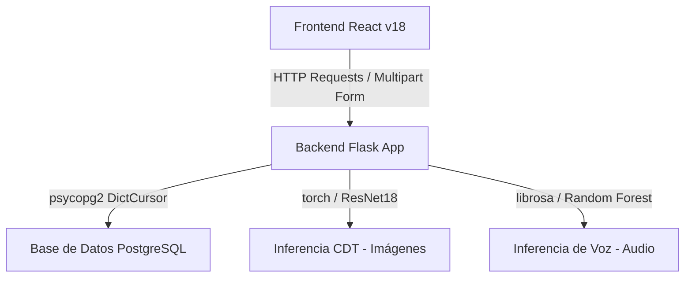

# Project: Cognitive Evaluation Intelligent System
## (Sistema Inteligente para Apoyo de la Evaluación del Deterioro Cognitivo)

Este archivo centraliza el contexto, los comandos de ejecución, el mapeo tecnológico, las reglas del desarrollador y la evidencia requerida para la redacción de la tesis de grado: **"Sistema inteligente para apoyar la evaluación del deterioro cognitivo en adultos mayores del Centro de Salud San Martín"**.

---

## 1. Contexto Académico de la Tesis
El sistema actúa como un soporte clínico digital e interactivo para neuropsicólogos y adultos mayores del Centro de Salud San Martín. Permite digitalizar y automatizar la aplicación de test cognitivos clave:
*   **MMSE (Mini-Mental State Examination):** Evaluación interactiva estructurada por categorías de capacidad intelectual.
*   **CDT (Clock Drawing Test / Test del Reloj):** Carga de dibujo manuscrito y clasificación automática mediante Redes Neuronales Convolucionales (CNN) usando criterios estandarizados de Shulman.
*   **SVF (Fluidez Verbal Semántica / Pruebas de Voz):** Captura acústica del paciente, extracción biométrica y pre-diagnóstico asistido por Inteligencia Artificial (Random Forest).

> [!IMPORTANT]
> **Aviso de Responsabilidad Clínica:** El sistema es una herramienta de **apoyo** y cribado secundario rápido. No reemplaza bajo ninguna circunstancia el diagnóstico profesional del neuropsicólogo. Todos los resultados generados por IA deben presentarse como estimaciones probabilísticas complementadas con recomendaciones de evaluación presencial exhaustiva.

---

## 2. Comandos de Ejecución y Configuración

### 2.1 Backend (Flask & IA Services)
*   **Directorio:** `backend/`
*   **Entorno de desarrollo:** Python 3.10+ con entorno virtual (`.venv`)
*   **Variables de Entorno (`backend/.env`):**
    ```ini
    DB_HOST=localhost
    DB_PORT=5432
    DB_NAME=deterioro_cognitivo
    DB_USER=postgres
    DB_PASSWORD=xxxxxx
    ```
*   **Comandos:**
    ```bash
    # Activar entorno virtual
    .venv\Scripts\activate      # Windows (PowerShell/CMD)
    source .venv/bin/activate    # Linux/macOS
    
    # Instalar dependencias
    pip install -r requirements.txt
    
    # Iniciar servidor Flask (Corre por defecto en Puerto 5001)
    python main.py
    ```

### 2.2 Frontend (React & TypeScript)
*   **Directorio:** `frontend/`
*   **Stack:** Vite + React + TS + Tailwind CSS v4 + Zustand + Shadcn UI + Tremor/Recharts.
*   **Variables de Entorno (`frontend/.env`):**
    ```ini
    VITE_API_URL=http://localhost:5001/api
    ```
*   **Comandos:**
    ```bash
    # Instalar dependencias
    npm install
    
    # Iniciar servidor de desarrollo en caliente
    npm run dev
    
    # Compilar código de producción
    npm run build
    ```

---

## 3. Arquitectura de Software y Mapeo Tecnológico

El sistema implementa una arquitectura desacoplada estructurada en tres capas principales:



### 3.1 Estructura del Código Fuente
*   `backend/app/controllers/`: Controladores MVC encargados de procesar la lógica de negocio y queries SQL (`paciente_controller.py`, `mmse_controller.py`, `cdt_controller.py`, `codigo_controller.py`, `resultados_controller.py`).
*   `backend/app/services/`: Lógica centralizada de Machine Learning e integraciones de IA:
    *   `cdt_inference_service.py`: Pipeline de Computer Vision. Redimensiona imágenes a $224 \times 224$ px, normaliza canales mediante valores ImageNet y ejecuta inferencia sobre `modelo_cdt_resnet18_final.pth`.
    *   `inferencia_voz.py`: Extrae biometría de la voz (13 coeficientes MFCCs, ZCR y Spectral Centroid) usando `librosa` y evalúa con el clasificador Random Forest (`voz_modelo_rf.pkl`).
*   `frontend/src/pages/`: Vistas de usuario reactivas para la administración clínica:
    *   `Pacientes/`: CRUD y seguimiento longitudinal.
    *   `CodigosAcceso/`: Generación de tokens de acceso temporal de 24 horas.
    *   `CDT/`: Subida y pre-evaluación visual del Test del Reloj.
    *   `MMSE/`: Flujo dinámico guiado del cuestionario estructurado.
    *   `VoiceTest/`: Captura guiada mediante API de micrófono del navegador y despliegue del análisis acústico.

---

## 4. Estructura de la Base de Datos (PostgreSQL Schema)

A partir del código fuente analizado, se detalla el esquema relacional implementado en PostgreSQL:

| Tabla | Atributos Principales | Descripción Clínica / Técnica |
| :--- | :--- | :--- |
| **`usuario`** | `id_usuario` (PK), `usua`, `contra`, `estado_usuario`, `id_rol` (FK) | Usuarios del sistema (personal médico). Soporta hashes bcrypt y contraseñas legacy. |
| **`rol`** | `id_rol` (PK), `nom_rol` | Control de accesos. Roles típicos: `Neuropsicólogo` (Rol 2), `Administrador` (Rol 3). |
| **`neuropsicologo`** | `id_neuropsicologo` (PK), `id_usuario` (FK), `nombres`, `apellidos`, `estado` | Datos del profesional a cargo de los pacientes. |
| **`paciente`** | `id_paciente` (PK), `nombres`, `apellidos`, `fecha_nacimiento`, `sexo`, `id_escolaridad` (FK), `id_neuropsicologo` (FK), `estado` | Expediente del paciente. `id_escolaridad` vincula al nivel de instrucción (factor corrector de MMSE). |
| **`nivel_escolaridad`** | `id_escolaridad` (PK), `nom_escolaridad`, `estado` | Niveles estandarizados: *Primaria* (1), *Secundaria* (2), *Superior* (3). |
| **`codigo_acceso`** | `id_asignacion` (PK/FK), `codigo_texto`, `estado_codigo` | Gestión de tokens efímeros para pacientes. Estados: `Activo` (1), `En progreso` (3). |
| **`asignacion_prueba`** | `id_asignacion` (PK), `id_paciente` (FK), `id_prueba` (FK), `fecha_generacion` | Vinculación única de una orden de evaluación. Expira a las 24 horas de generada. |
| **`prueba_catalogo`** | `id_prueba` (PK), `nombre_prueba`, `puntaje_maximo`, `estado` | Catálogo de pruebas disponibles: *Test del Reloj (CDT)*, *MMSE*, *Voz*. |
| **`evaluacion_cognitiva`** | `id_evaluacion` (PK), `id_asignacion` (FK), `fecha_evaluacion`, `estado_evaluacion`, `puntaje_total`, `diagnostico_ia`, `observaciones` | Cabecera clínica del test. Almacena las conclusiones e inferencias diagnósticas de la IA. |
| **`analisis_visual`** | `id_analisis` (PK), `id_evaluacion` (FK), `url_imagen`, `puntaje_ia`, `detalles_ia` (JSONB) | Resultados específicos del CDT. Guarda la ruta física de la imagen y los detalles metodológicos. |
| **`resultado_categoria`** | `id_evaluacion` (PK/FK), `id_categoria` (PK/FK), `puntaje_obtenido` | Desglose paramétrico del puntaje obtenido por el paciente en cada subcategoría del MMSE. |
| **`categoria_mmse`** | `id_categoria` (PK), `nombre_categoria`, `puntaje_maximo`, `estado` | Dimensiones del MMSE: *Orientación*, `Memoria`, `Atención`, `Cálculo`, `Lenguaje`, `Construcción`. |

---

## 5. Especificación de la API REST (Rutas y Contratos)

### 5.1 Gestión y Autenticación
*   `POST /api/auth/login` - Inicio de sesión clínico (médico). Retorna datos del perfil y JWT.
*   `POST /api/auth/patient-login` - Login rápido para paciente vía código temporal de acceso. Actualiza estado del código a 3 (*En progreso*).
*   `GET /api/auth/me` - Validación del token de sesión activo.
*   `POST /api/auth/logout` - Finalización de sesión clínica segura.

### 5.2 Gestión de Pacientes y Personal
*   `GET /api/auth/obtener_paciente` - Retorna la nómina de pacientes. Filtra por `id_neuropsicologo` si es rol asistencial.
*   `POST /api/auth/obtener_paciente` - Creación de expediente de nuevo paciente.
*   `PUT /api/auth/obtener_paciente/<int:id_paciente>` - Actualización de datos clínicos.
*   `DELETE /api/auth/obtener_paciente/<int:id_paciente>` - Eliminación del expediente en base a sus restricciones de integridad.
*   `GET /api/auth/escolaridades` - Listado de niveles de instrucción académica formal.

### 5.3 Asignación y Tokens de Acceso
*   `GET /api/auth/obtener_codigos` - Recupera los códigos generados y sus estados de vencimiento.
*   `POST /api/auth/generar_codigo` - Genera y asocia un código aleatorio para una prueba específica.
*   `DELETE /api/auth/obtener_codigos/<int:id_asignacion>` - Invalida o elimina un token de acceso.

### 5.4 Evaluación Cognitiva Digitalizada (MMSE)
*   `GET /api/mmse/estructura/<int:id_asignacion>` - Retorna la configuración completa del test y el historial del paciente asociado.
*   `POST /api/mmse/evaluacion/iniciar` - Registra el inicio de una sesión formal de evaluación cognitiva.
*   `POST /api/mmse/evaluacion/seccion` - Guarda la calificación de una dimensión específica del test.
*   `POST /api/mmse/evaluacion/respuesta` - Almacena las respuestas individuales para auditoría granular.
*   `POST /api/mmse/evaluacion/finalizar/<int:id_evaluacion>` - Realiza la agregación aritmética de puntajes y cierra el registro clínico.

### 5.5 Inferencia con Inteligencia Artificial (CDT - Test del Reloj)
*   `POST /api/cdt/upload`
    *   **Método:** `POST` (Multipart FormData)
    *   **Inputs:** `file` (imagen PNG/JPG), `id_asignacion` (integer)
    *   **Procesamiento:** Validación de formato -> Redimensionamiento y preprocesamiento de imagen -> Clasificación por ResNet18 -> Guardado físico -> Inserción transaccional en `evaluacion_cognitiva` y `analisis_visual`.
    *   **Validación de Calidad:** Si la confianza es menor al 55%, o el dibujo no se pre-valida como un reloj, se retorna código de estado `422 (Unprocessable Entity)` solicitando una fotografía legible y centrada.
    *   **Escala de Salida (Criterios Shulman / NHATS):**
        *   **5:** *Normal* (Visuoespacialidad y funciones ejecutivas preservadas).
        *   **4:** *Nivel Límite* (Desviación espacial mínima).
        *   **3:** *Deterioro Leve (Posible MCI)* (Fallo de planificación, números amontonados).
        *   **2:** *Deterioro Moderado* (Errores estructurales graves o manecillas erróneas).
        *   **1:** *Deterioro Severo* (Pérdida de la representación conceptual de la prueba).
        *   **0:** *Deterioro Muy Severo* (Dibujo ausente, garabatos irreconocibles).

---

## 6. Párrafos Redactados listos para la Tesis (Español Académico)

Estos textos están formateados con la rigurosidad científica exigida por los jurados de tesis de ingeniería informática, listos para ser incorporados en tu informe escrito:

### 6.1 Justificación Teórica de la Arquitectura
> *"Para garantizar la escalabilidad, modularidad y mantenibilidad exigidas en un entorno de salud primaria como el Centro de Salud San Martín, se diseñó e implementó una arquitectura de software desacoplada de tres capas basada en el patrón arquitectónico cliente-servidor. El frontend, construido sobre la librería reactiva React bajo el estándar moderno TypeScript, delega la carga computacional intensiva de inferencia y la persistencia de datos relacionales a un backend RESTful impulsado por Flask en Python 3. Esta separación estratégica permite mitigar las limitaciones de los dispositivos finales del Centro de Salud, trasladando los requerimientos de memoria y CPU demandados por los modelos de aprendizaje profundo (Deep Learning) hacia el servidor central, logrando así un tiempo de respuesta de inferencia menor a dos segundos por prueba."*

### 6.2 Explicación Científica del Modelo CDT (ResNet18)
> *"El análisis automático del Test del Reloj (CDT) se realiza a través de un clasificador supervisado implementado sobre la arquitectura de red neuronal convolucional ResNet18. Mediante la técnica de Transfer Learning (Aprendizaje por Transferencia), se reaprovecharon los pesos previamente optimizados de ImageNet y se reestructuró la capa de clasificación lineal (Fully Connected Layer) para mapear las características espaciales del dibujo hacia seis clases discretas, correspondientes a los puntajes analíticos de la escala clínica estandarizada de Shulman (0 a 5 puntos). Para mitigar falsos positivos originados por la captura defectuosa de imágenes en el consultorio, el sistema integra un pipeline de pre-validación matemática que rechaza imágenes cuya probabilidad de confianza visuoespacial sea inferior al umbral del 55%, exigiendo una nueva captura y protegiendo así la integridad de los datos clínicos del expediente del paciente."*

### 6.3 Explicación Científica del Módulo de Voz (Random Forest)
> *"El análisis biométrico de la voz del paciente para la identificación de biomarcadores acústicos asociados al deterioro cognitivo se estructura bajo una metodología híbrida de procesamiento de señales y aprendizaje automático. Utilizando la biblioteca matemática Librosa, se procesan los registros de voz en formato acústico lineal, extrayendo un vector de 15 características biométricas: 13 Coeficientes Cepstrales en las Frecuencias de Mel (MFCCs) para caracterizar el tracto vocal, el Centroide Espectral (Spectral Centroid) para evaluar el brillo tímbrico, y la Tasa de Cruce por Cero (ZCR) como descriptor de irregularidades glóticas o ronquera. Este vector de características es procesado secuencialmente por un Scaler matemático y clasificado mediante un modelo Random Forest (Bosques Aleatorios). Dicha arquitectura de conjunto (Ensemble) ofrece una alta resistencia al sobreajuste (overfitting) en datasets clínicos de tamaño moderado, entregando una probabilidad diagnóstica discriminativa entre control sano y sospecha de deterioro cognitivo."*

---

## 7. Plan de Evidencia y Checklist para el Reporte de Tesis (Sprint 3)

Utiliza esta checklist para recopilar la evidencia empírica requerida para la aprobación de tus entregables del Sprint 3 ante tu asesor de tesis:

### 7.1 Checklist de Capturas de Pantalla (Screenshots Required)
- [ ] **Vista de Login:** Interfaz con credenciales del Neuropsicólogo y la opción alternativa de "Ingreso de Paciente mediante Código".
- [ ] **Dashboard de Pacientes:** Tabla interactiva mostrando nombres, edades, sexo, nivel escolaridad y los estados clínicos del expediente.
- [ ] **Módulo de Códigos:** Generación en tiempo real del token alfanumérico, mostrando su vigencia y la opción de eliminación.
- [ ] **Flujo del MMSE:** Pantalla de aplicación clínica, evidenciando las preguntas del evaluador y los botones de puntuación por categoría.
- [ ] **Carga de Test del Reloj (CDT):** Drag & drop del dibujo del reloj con la previsualización de la imagen antes del envío.
- [ ] **Visualización de Resultados (Radar Chart):** El gráfico de radar interactivo en la sección de informes que desglosa visualmente las capacidades cognitivas del MMSE y la puntuación de IA del CDT del paciente.
- [ ] **Simulador de Grabación de Voz:** Barra de progreso dinámico por preguntas de fluidez semántica, botón de grabación micrófono y pantalla de carga del procesamiento acústico.

### 7.2 Casos de Prueba para Demostración (Test Cases)
1.  **Caso de Login de Paciente por Código Temporal:**
    *   *Entrada:* Código generado de 6 dígitos.
    *   *Paso:* Ingresar código en la pantalla de inicio.
    *   *Resultado esperado:* Redirección inmediata a las instrucciones de la prueba asignada. Actualización del estado del código en BD a `3 (En progreso)`.
2.  **Caso de Rechazo de Imagen en CDT (Falla de Validación):**
    *   *Entrada:* Subida de una fotografía borrosa o de un paisaje de fondo.
    *   *Resultado esperado:* Respuesta HTTP `422 Unprocessable Entity` con mensaje aclaratorio de que la imagen no fue reconocida como un dibujo de reloj.
3.  **Caso de Inferencia de CDT con Puntuación Normal:**
    *   *Entrada:* Fotografía de un reloj correctamente dibujado (círculo cerrado, doce números ordenados y manecillas en hora 11:10).
    *   *Resultado esperado:* Puntuación IA calculada = 5, clasificación = "Normal", sin alertas y con la descripción clínica de preservación ejecutiva.
4.  **Caso de Envío de Test MMSE Completo:**
    *   *Paso:* Completar todas las subsecciones, registrando respuestas correctas e incorrectas, y presionar "Finalizar".
    *   *Resultado esperado:* Persistencia correcta en `evaluacion_cognitiva` y `resultado_categoria`, con redirección al dashboard e inicialización del gráfico comparativo.
