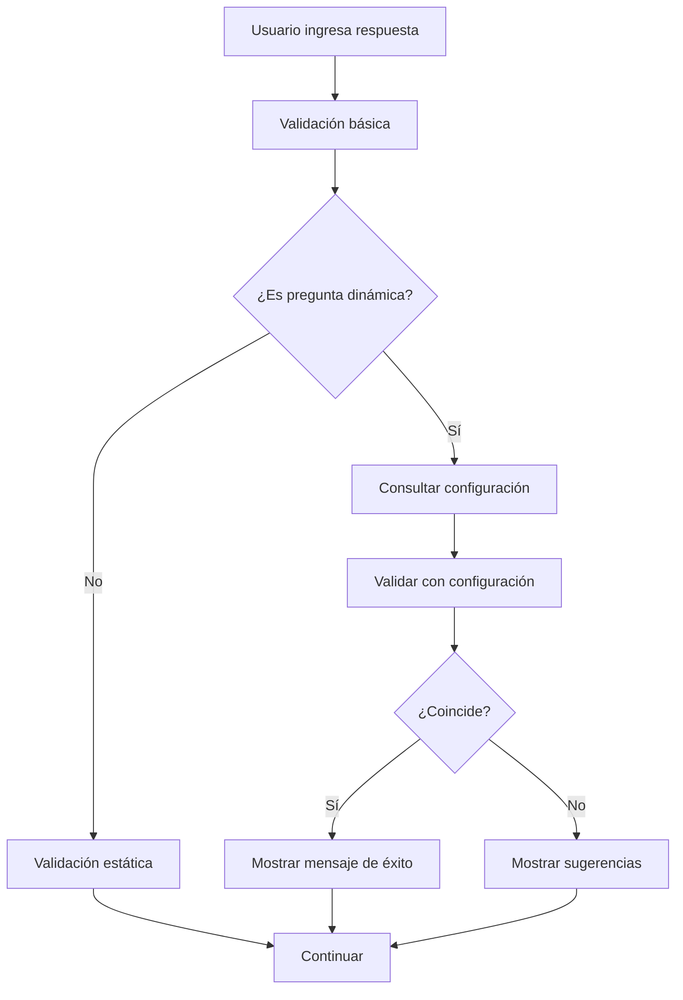

# Sistema de Configuración Dinámica de Respuestas Correctas - MMSE

## 📋 Descripción General

Se ha implementado un sistema completo de configuración dinámica para las respuestas correctas del test MMSE, permitiendo a los administradores gestionar las respuestas aceptables sin necesidad de modificar código.

## 🏗️ Arquitectura del Sistema

### 1. **Base de Datos**

#### Tabla Principal: `mmse_prueba_cognitiva_configuracion`

```sql
CREATE TABLE mmse_prueba_cognitiva_configuracion (
    id_configuracion BIGSERIAL PRIMARY KEY,
    id_prueba BIGINT NOT NULL REFERENCES prueba_cognitiva(id_prueba),
    pregunta_id VARCHAR(50) NOT NULL,
    respuesta_correcta TEXT NOT NULL,
    contexto VARCHAR(100), -- ej: "hospital_general", "clinica_privada"
    tipo_validacion VARCHAR(20) NOT NULL DEFAULT 'exacta',
    tolerancia_errores INTEGER DEFAULT 0,
    puntuacion DECIMAL(3,2) DEFAULT 1.00,
    es_activa BOOLEAN NOT NULL DEFAULT true,
    orden INTEGER DEFAULT 1,
    creado_en TIMESTAMP WITH TIME ZONE DEFAULT NOW(),
    actualizado_en TIMESTAMP WITH TIME ZONE DEFAULT NOW()
);
```

#### Campos Clave:

- **pregunta_id**: Identificador de la pregunta (ej: 'establecimiento', 'pais', 'piso')
- **respuesta_correcta**: Respuesta considerada correcta
- **contexto**: Contexto específico donde aplica (ej: 'hospital_general', 'clinica_privada')
- **tipo_validacion**: Tipo de validación ('exacta', 'parcial', 'fuzzy')
- **tolerancia_errores**: Número de caracteres de diferencia permitidos (0-3)
- **puntuacion**: Puntuación que otorga esta respuesta (0.00 - 1.00)

### 2. **Backend**

#### Servicio: `MMSEConfigService`
- **Ubicación**: `backend/app/services/mmse_config_service.py`
- **Funcionalidades**:
  - CRUD completo de configuraciones
  - Validación inteligente con tolerancia a errores
  - Algoritmo de distancia de Levenshtein para fuzzy matching
  - Gestión de contextos y preguntas

#### Endpoints REST API:
- **GET** `/api/mmse/configuracion/respuestas` - Listar configuraciones
- **POST** `/api/mmse/configuracion/respuestas` - Crear configuración
- **PUT** `/api/mmse/configuracion/respuestas/{id}` - Actualizar configuración
- **DELETE** `/api/mmse/configuracion/respuestas/{id}` - Eliminar configuración
- **GET** `/api/mmse/configuracion/validacion/{pregunta_id}` - Obtener configuraciones para validación
- **POST** `/api/mmse/configuracion/validar-respuesta` - Validar respuesta del usuario

### 3. **Frontend**

#### Servicio: `mmseConfigService`
- **Ubicación**: `frontend/src/services/mmseConfigService.ts`
- **Funcionalidades**:
  - Comunicación con API backend
  - Validación en tiempo real
  - Gestión de errores y respuestas

#### Interfaz de Administración:
- **Ubicación**: `frontend/src/pages/Admin/MMSEConfiguracion.tsx`
- **Funcionalidades**:
  - CRUD completo de configuraciones
  - Filtros por pregunta y contexto
  - Validación de formularios
  - Interfaz intuitiva con tablas y modales

## 🔧 Tipos de Validación

### 1. **Validación Exacta**
- Comparación exacta entre respuesta del usuario y configuración
- Tolerancia: 0 errores
- Ejemplo: "Hospital General" = "Hospital General" ✅

### 2. **Validación Parcial**
- Busca coincidencias parciales (contiene o es contenido)
- Útil para respuestas más flexibles
- Ejemplo: "Hospital" contiene "Hospital General" ✅

### 3. **Validación Fuzzy**
- Usa algoritmo de distancia de Levenshtein
- Permite errores tipográficos y variaciones
- Configurable (0-3 caracteres de diferencia)
- Ejemplo: "Ospital" vs "Hospital" (1 error) ✅

## 📊 Ejemplos de Configuración

### Establecimiento - Hospital General
```json
{
  "pregunta_id": "establecimiento",
  "respuesta_correcta": "Hospital General",
  "contexto": "hospital_general",
  "tipo_validacion": "exacta",
  "tolerancia_errores": 0,
  "puntuacion": 1.00
}
```

### Establecimiento - Con Tolerancia a Errores
```json
{
  "pregunta_id": "establecimiento",
  "respuesta_correcta": "Hospital",
  "contexto": "hospital_general",
  "tipo_validacion": "fuzzy",
  "tolerancia_errores": 1,
  "puntuacion": 0.90
}
```

## 🎯 Casos de Uso Reales

### 1. **Usuario escribe "posta"**
- ✅ **Aceptado** con sugerencia: "Posta Médica"
- **Puntuación**: 1.0
- **Mensaje**: "✅ Respuesta correcta: Posta"

### 2. **Usuario escribe "clinica" (sin tilde)**
- ✅ **Aceptado** con validación fuzzy
- **Puntuación**: 0.95
- **Mensaje**: "⚠️ Respuesta aceptada (¿quiso decir: Clínica?)"

### 3. **Usuario escribe "ospital" (falta H)**
- ✅ **Aceptado** con validación fuzzy
- **Puntuación**: 0.90
- **Mensaje**: "⚠️ Respuesta aceptada (¿quiso decir: Hospital?)"

### 4. **Usuario escribe "casa"**
- ✅ **Permitido** pero con sugerencias
- **Puntuación**: 0.0
- **Mensaje**: "💡 Opciones sugeridas: Hospital General, Clínica Privada, Posta"

## 🚀 Instalación y Configuración

### 1. **Base de Datos**
```bash
# Ejecutar el script SQL
psql -d tu_base_de_datos -f backend/database/mmse_configuracion.sql
```

### 2. **Backend**
```bash
# Las rutas ya están registradas en app/__init__.py
# No se requieren pasos adicionales
```

### 3. **Frontend**
```bash
# Agregar la ruta de administración en tu router
import MMSEConfiguracion from '@/pages/Admin/MMSEConfiguracion'

// Agregar ruta
{
  path: '/admin/mmse-configuracion',
  element: <MMSEConfiguracion />
}
```

## 📱 Uso del Sistema

### Para Administradores:

1. **Acceder a la interfaz**: `/admin/mmse-configuracion`
2. **Crear configuración**:
   - Seleccionar pregunta (ej: establecimiento)
   - Ingresar respuesta correcta
   - Configurar contexto (opcional)
   - Elegir tipo de validación
   - Establecer tolerancia y puntuación

3. **Gestionar configuraciones**:
   - Filtrar por pregunta o contexto
   - Editar configuraciones existentes
   - Activar/desactivar configuraciones
   - Eliminar configuraciones obsoletas

### Para Usuarios del MMSE:

1. **Validación automática**: El sistema valida en tiempo real
2. **Retroalimentación inmediata**: Mensajes de sugerencia y corrección
3. **Puntuación inteligente**: Basada en calidad de la respuesta
4. **Flexibilidad**: Permite continuar aunque la respuesta no sea exacta

## 🔍 Monitoreo y Mantenimiento

### Logs del Sistema:
- **Backend**: Logs en `mmse_config_service.py`
- **Frontend**: Console warnings para errores de validación

### Métricas Recomendadas:
- Respuestas más comunes por pregunta
- Errores de validación frecuentes
- Contextos más utilizados
- Efectividad de diferentes tipos de validación

## 🔧 Personalización Avanzada

### Agregar Nuevas Preguntas:
1. Agregar configuración en la base de datos
2. Actualizar la lista `dynamicQuestions` en `mmseValidations.ts`
3. Opcional: Agregar a la interfaz de administración

### Crear Nuevos Contextos:
1. Agregar configuraciones con el nuevo contexto
2. El sistema detectará automáticamente el nuevo contexto
3. Aparecerá en los filtros de la interfaz de administración

### Ajustar Algoritmos de Validación:
- Modificar `_levenshtein_distance()` en el servicio backend
- Ajustar umbrales de tolerancia por contexto
- Personalizar mensajes de retroalimentación

## 🛡️ Seguridad y Permisos

### Roles Requeridos:
- **Administrador**: CRUD completo de configuraciones
- **Neuropsicólogo**: Solo lectura de configuraciones
- **Paciente**: Solo validación en tiempo real

### Validaciones de Seguridad:
- Autenticación JWT requerida
- Validación de tipos de datos
- Sanitización de inputs
- Límites en tolerancia de errores (0-3)

## 📈 Beneficios del Sistema

1. **Flexibilidad**: Adaptable a diferentes contextos y necesidades
2. **Escalabilidad**: Fácil agregar nuevas preguntas y respuestas
3. **Mantenibilidad**: Cambios sin modificar código
4. **Usabilidad**: Retroalimentación clara para usuarios
5. **Precisión**: Validación inteligente con tolerancia a errores
6. **Auditabilidad**: Historial completo de configuraciones

## 🔄 Flujo de Trabajo



## 🎉 Conclusión

El sistema de configuración dinámica de respuestas correctas para el MMSE proporciona una solución robusta, flexible y fácil de mantener para gestionar las respuestas aceptables del test, adaptándose a diferentes contextos y necesidades específicas de cada institución.
