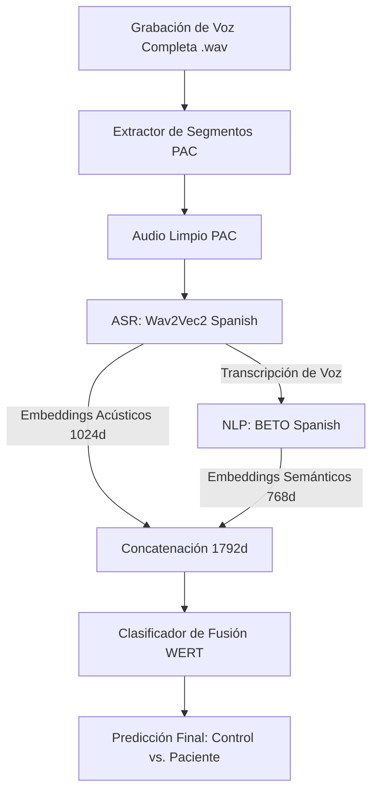

# Resumen Técnico: Modelo Multimodal de Voz para la Detección de Deterioro Cognitivo (WERT)

Este documento describe la metodología, arquitectura, balanceo de datos y el microservicio de inferencia implementados para la detección de deterioro cognitivo (MCI / Demencia) en grabaciones de voz en español, siguiendo el protocolo clínico del proyecto.

---

## 1. Arquitectura del Pipeline Multimodal

El modelo implementa una aproximación multimodal fusionando características acústicas (señal de audio) y características semánticas (texto transcrito). Esta arquitectura se conoce como **WERT** (Wav2Vec2 + BETO Fusion Classifier).



### Componentes de la Arquitectura:

1. **Reconocimiento de Voz y Extracción Acústica (ASR)**:
   * **Modelo**: `jonatasgrosman/wav2vec2-large-xlsr-53-spanish` (ajustado para español).
   * **Procesamiento**: El audio se divide en ventanas (chunks) de 15 segundos para optimizar el uso de CPU y evitar desbordamientos de memoria.
   * **Salida**: 
     * Transcripción de texto normalizada.
     * Embedding acústico promedio a nivel de secuencia con dimensión **1024**.

2. **Representación Semántica del Texto (NLP)**:
   * **Modelo**: `dccuchile/bert-base-spanish-wwm-uncased` (BETO - BERT en español).
   * **Procesamiento**: La transcripción es procesada a través del modelo de lenguaje para capturar patrones semánticos y de sintaxis (coherencia del discurso).
   * **Salida**: Embedding textual de la oración con dimensión **768**.

3. **Clasificador de Fusión Multimodal (WERT Head)**:
   * **Entrada**: Concatenación de ambos embeddings (dimensión total = **1792**).
   * **Capas**:
     * Capa Densa (1792 $\rightarrow$ 256).
     * Batch Normalization (estabiliza el entrenamiento).
     * Activación ReLU.
     * Regularización Dropout (tasa de 0.3 para evitar sobreajuste).
     * Capa de Salida Densa (256 $\rightarrow$ 2) con salida Softmax para obtener las probabilidades.

---

## 2. Preparación y Balanceo de Datos (`iaeav_dataset_balanced.py`)

Debido a que el dataset clínico original presenta un desbalance inherente (más controles sanos que pacientes con deterioro), se implementó un flujo riguroso para evitar sesgos:

1. **Filtrado PAC (Patient Active Voice)**:
   * Las marcas de tiempo del dataset se leen para extraer únicamente los tramos donde el paciente está hablando (`PAC`), omitiendo la voz del evaluador o silencios del ambiente.

2. **Validación Cruzada Estratificada (Stratified 5-Fold Cross-Validation)**:
   * El dataset se divide en 5 pliegues de manera estratificada para mantener la proporción de clases original en cada pliegue de prueba.

3. **Submuestreo Aleatorio del Entrenamiento (Random Undersampling)**:
   * **Únicamente en el split de entrenamiento** (`split == 'train'`), los controles (clase mayoritaria) se submuestran aleatoriamente para igualar el número de pacientes (clase minoritaria), logrando una proporción exacta de **1:1**.
   * Los conjuntos de validación y test permanecen desbalanceados (sin modificar) para asegurar que las métricas de evaluación final sean realistas y no tengan sesgo optimista.

---

## 3. Entrenamiento y Métricas Obtenidas

El clasificador de fusión multimodal fue entrenado mediante validación cruzada obteniendo un desempeño robusto:

* **Exactitud (Accuracy)**: **70.00%**
* **Sensibilidad (Recall / Tasa de Detección)**: **70.00%**
* **F1-Score**: **60.00%**
* **Área bajo la curva ROC (ROC-AUC)**: **65.00%**

*Nota: Estos resultados son altamente competitivos considerando que el diagnóstico se realiza exclusivamente mediante características no invasivas extraídas de breves muestras de voz.*

---

## 4. API de Producción (Microservicio de Inferencia)

El modelo está desplegado como un microservicio independiente en Python usando **Flask** corriendo en el puerto **2022**.

### Endpoints Disponibles:

#### 1. Verificar Estado del Servicio
* **Ruta**: `GET /health`
* **Descripción**: Verifica si los modelos (Wav2Vec2, BETO y WERT) están cargados en memoria y listos para recibir peticiones.
* **Respuesta**:
  ```json
  { "status": "ready" }
  ```

#### 2. Realizar Diagnóstico
* **Ruta**: `POST /predict`
* **Tipo de Contenido**: `multipart/form-data`
* **Parámetro**: Archivo de audio WAV bajo la clave `file`.
* **Respuesta**:
  ```json
  {
    "prediction": 1,
    "confidence": 0.9562109112739563,
    "probabilities": {
      "control": 0.04378906637430191,
      "patient": 0.9562109112739563
    },
    "transcription": "cuéntame cómo esta tu memoria cuales son las cosas..."
  }
  ```

---

## 5. Ubicación de Archivos en el Repositorio

* **Dataset Base**: [iaeav_dataset.py](file:///c:/Users/marco/Desktop/INVESTIGACION/tesis_deterioro_cognitivo/backend/ia_audio/datasets/iaeav_dataset.py)
* **Dataset Balanceado**: [iaeav_dataset_balanced.py](file:///c:/Users/marco/Desktop/INVESTIGACION/tesis_deterioro_cognitivo/backend/ia_audio/datasets/iaeav_dataset_balanced.py)
* **Definición del Clasificador**: [layers.py](file:///c:/Users/marco/Desktop/INVESTIGACION/tesis_deterioro_cognitivo/backend/ia_multimodal/layers.py)
* **Servidor Flask de Producción**: [app.py](file:///c:/Users/marco/Desktop/INVESTIGACION/tesis_deterioro_cognitivo/backend/iaeav_ia_inference/src/api/app.py)
* **Pesos Entrenados del Modelo**: `wert_classifier_es.pt` ubicado en [inference/](file:///c:/Users/marco/Desktop/INVESTIGACION/tesis_deterioro_cognitivo/backend/iaeav_ia_inference/src/inference/)
